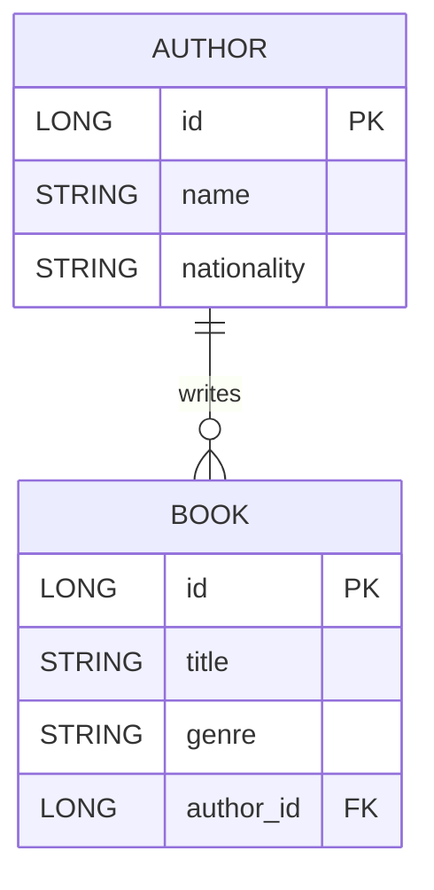

# Spring Boot CRU Assignment Report

## Project Overview
This project implements a Spring Boot MVC application that manages Authors and Books. The system supports Create, Read, and Update operations (CRU) for Book records while maintaining a one-to-many relationship between Author and Book. The app uses Spring Data JPA with an in-memory H2 database, JSP views, and unit tests with JUnit 5 and Mockito.

## Tech Stack
- Spring Boot 4.0.6 (MVC + Data JPA)
- Java 25
- H2 in-memory database
- JSP + JSTL for views
- Maven build
- JUnit 5, Mockito, AssertJ for testing

## Entity Relationship Design (Mermaid)

## Entities and Relationships
- Author has `id`, `name`, `nationality`, and `books`.
- Book has `id`, `title`, `genre`, and `author`.
- Relationship: One Author can have many Books; each Book belongs to one Author.

## Data Initialization
On startup, the application inserts 10 Authors and 10 Books using a CommandLineRunner. Each Book is associated with a unique Author.

## CRU Operations
### Create
- UI: Add Book form.
- Controller: POST `/books`.
- Service: `saveBook()` handles persistence and wraps `DataIntegrityViolationException` into `DatabaseException`.

### Read
- UI: Books list table.
- Controller: GET `/books`.
- Repository: `findAllBooksWithAuthors()` uses JPQL `join fetch` to fetch Books with Authors.

### Update
- UI: Edit Book form.
- Controller: GET `/books/edit/{id}` and POST `/books/update/{id}`.
- Service: `updateBook()` updates and saves the existing entity.

## Exception Handling
- Save and update operations catch `DataIntegrityViolationException` and throw a custom `DatabaseException`.
- UI shows the error message on the form page.

## View Layer (JSP)
- `list.jsp` displays a table of books with author names and an Edit button.
- `form.jsp` is used for both create and update with a dropdown of authors.
- JSTL (`jakarta.tags.core`) is used for iteration and conditionals.

## Testing
- Service tests use Mockito to validate create, read, update, and error handling behavior.
- Repository test validates that the join query returns Books with Authors.

## How to Run
1. `./mvnw.cmd clean test`
2. `./mvnw.cmd spring-boot:run`
3. Open `http://localhost:8080/books`
4. H2 console: `http://localhost:8080/h2-console`

## Screenshots
### List Page

### Create Form

### After Create

### Edit Form

### After Update

## Challenges and Solutions
- Repository test annotation: Spring Boot 4.0.6 does not provide `@DataJpaTest` in the classpath, so the repository test uses `@SpringBootTest` with `@Transactional` to verify JPA behavior.
- JSP support with Boot 4: the project is packaged as WAR and includes Jasper + JSTL dependencies to render JSP pages.

## GitHub URL
- https://github.com/r44gh4v/bits-ass-bda-springboot
